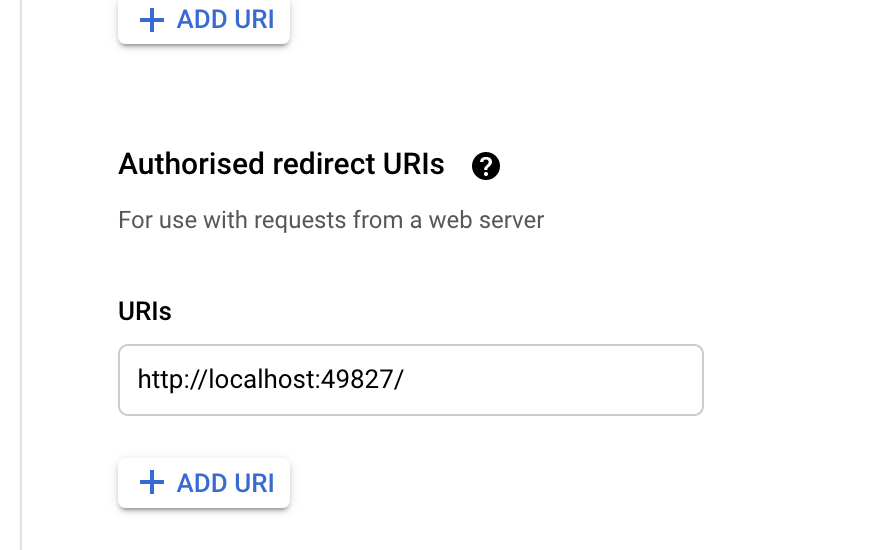

### APP setup
https://blog.mailtrap.io/send-emails-with-gmail-api/#Step_9_Read_a_specific_email_from_your_inbox

### Install Libraries
pip install -r requirements.txt

### Google Gmail API
https://developers.google.com/gmail/api/reference/rest/v1/users.messages#Message.MessagePart

### ARK Invest data source
https://ark-funds.com/investor-resources?utm_medium=email&_hsmi=66214954&_hsenc=p2ANqtz--UXH9DI1JCSJ2Dg173X56SkBOsigaY4fEkBv8FL7whi0A8-YYYfnOfQwKif9abm8jGqAsrs4a918EOIo6pNudVH8DENw&utm_content=66214954&utm_source=hs_automation

### Build docker iamge
docker build . -t ark-go-email

### Run it locally
docker run -p 9000:8080 ark-go-email:latest

### Test it locally
curl -XPOST "http://localhost:9000/2015-03-31/functions/function/invocations" -d '{}'

### Push to ecr
Follow this post to push it to ecr: https://dev.to/jiayanguo/another-milestone-of-aws-lambda-45f3
```
docker tag ark-go-email:latest 120400168286.dkr.ecr.us-west-2.amazonaws.com/ark-go-email:latest
aws ecr get-login-password --region us-west-2 | docker login --username AWS --password-stdin 120400168286.dkr.ecr.us-west-2.amazonaws.com
docker push 120400168286.dkr.ecr.us-west-2.amazonaws.com/ark-go-email:latest
```

### Troube shooting.
1. Error 400: redirect_uri_mismatch
The redirect URI in the request, http://localhost:49619/, does not match the ones authorized for the OAuth client. To update the authorized redirect URIs, visit: https://console.developers.google.com/apis/credentials/oauthclient/${your_client_id}?project=${your_project_number}

Edit the credential to add an authorised redirect URIs.
